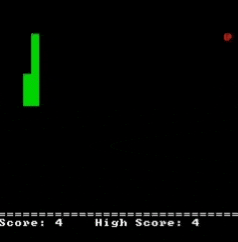
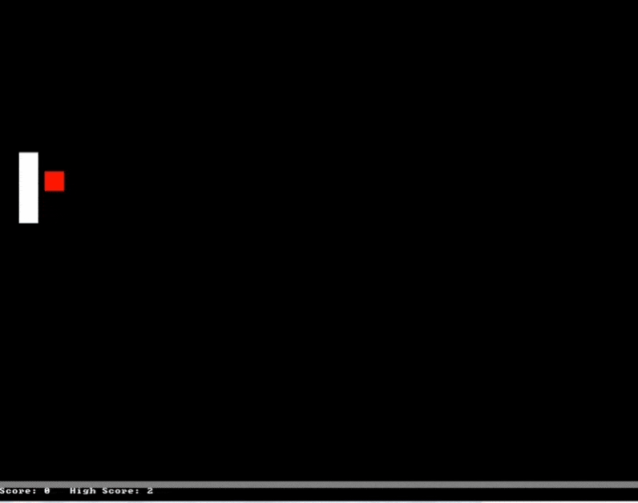

# ConsoleGameEngine
## Description
A basic game engine written in C++ which uses the Windows command console as a canvas. Included are several projects created using the game engine as a base, such as Snake, Pong, A cellular automata simulation, and a 3D raycaster demo. These were all personal projects I created mainly for fun, but it also gave me some good object oriented programming practice.
## Snake
A basic implementation of Snake with a score and high score counter. This was the first project I implemented using this engine and chose Snake to test out all its features.
### Demo

## Pong
An implementation of one player Pong. My first project implementing collisions in a physics simulation using hitboxes.
### Demo

## Cellular Automata / Conway's Game of Life
An implementation of a generalized cellular automata. This simulation is strutured to allow any ruleset to be chosen with two input strings, one that specifies cell birth, and one that specifies whether a living cell stays alive. Simulations are also highly modular, with an entire simulation being encapsulated in a single object. This it easy to run several independant simulations at once. 
### Demo
Shown are Conway's Game of Life (left), and ruleset B34/S23 (right)

## 3D Raycaster
An implementation of a full 3D raycaster. This raycaster is very simple, including only spheres as objects. Basic lighting/depth perception was created by choosing an ASCII character with higher or lower intensity per cell, with higher intensity characters being used when the camera is closer to the object. This makes it seem like the camera is emitting light.

